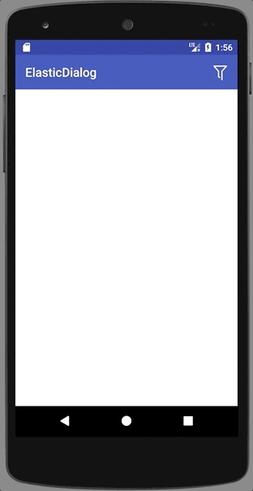

# ElasticDialog
一个弹性dialog

# 效果图



如果你是AndroidStudio用户,在build.gradle中添加

```
compile 'com.cool: elasticdialog:1.0.0'
```

### 使用
* 初始化

	    private void initDialog() {
        if(elasticDialog== null) {
            elasticDialog = new ElasticDialog(this);
            elasticDialog.layout(R.layout.dialog_elastic)
                    .arcColor(Color.WHITE)
                    .duration(1000)
                    .arcHight(40);
            mRecyclerView = elasticDialog.findViewById(R.id.recyclerview);
        	}
    	}

    	
    布局文件dialog_elastic.xml
   
    	<?xml version="1.0" encoding="utf-8"?>
		<FrameLayout xmlns:android="http://	schemas.android.com/apk/res/android"
    	android:layout_width="match_parent"
    	android:layout_height="match_parent">
    		<android.support.v7.widget.RecyclerView
        		android:id="@+id/recyclerview"
        		android:layout_width="match_parent"
        		android:layout_height="300dp"
        		android:layout_gravity="bottom">

    	</android.support.v7.widget.RecyclerView>
	</FrameLayout>


* 调用
 
   		elasticDialog.show();  
    
    
博客地址：

[封装弹性dialog框架,使用只需一行代码](http://www.jianshu.com/p/bc33a0b1ccce)

[封装弹性dialog框架,使用只需一行代码](http://blog.csdn.net/cool_fuwei/article/details/76589491)